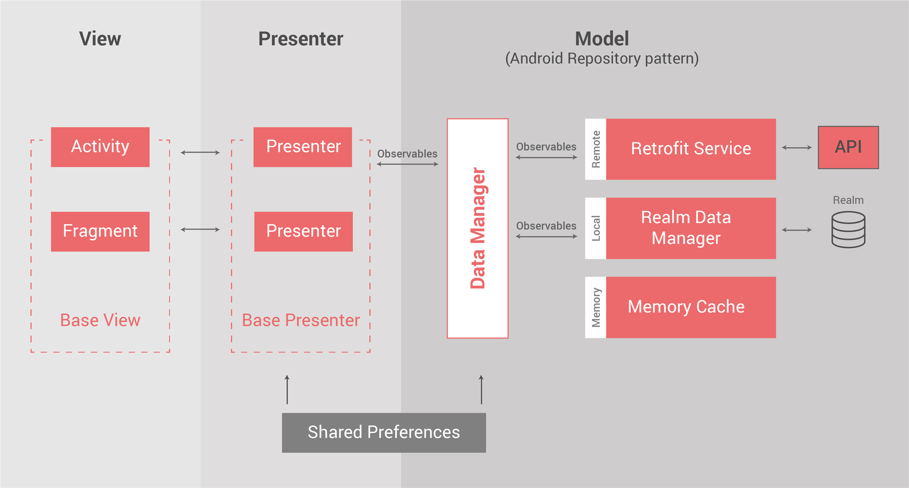

# TAS Android Boilerplate
<p align="center">
  
</p>

This is one of the boilerplates that [The App Solutions](https://theappsolutions.com/) company developers are using as a foundation for new Android projects. 
It is result of years of experiments and refinement of the architecture and guidelines on various company's projects. This particular boilerplate provides basic set utilities for resolving common tasks.

## Tech stack

- Android Support libraries
- [RxJava 2](https://github.com/ReactiveX/RxJava) and [RxAndroid](https://github.com/ReactiveX/RxAndroid)
- [Retrofit 2](http://square.github.io/retrofit/) as REST Client
- Dependency Injection with [Dagger 2](http://google.github.io/dagger/)
- [Realm](https://github.com/realm/realm-java) as local database
- [Butterknife](https://github.com/JakeWharton/butterknife)
- [Firebase Analytics](https://firebase.google.com/docs/analytics/android/start/)
- [Fabric Analytics and Crashlytics](https://docs.fabric.io/android/fabric/overview.html)
- [Annimon](https://github.com/aNNiMON/Lightweight-Stream-API) Stream Backport
- [Timber](https://github.com/JakeWharton/timber)
- [Glide](https://github.com/bumptech/glide) for picture processing
- [RxBinding](https://github.com/JakeWharton/RxBinding)
- [Realm Adapter](https://github.com/realm/realm-android-adapters)
- [JAVA Tuples](https://github.com/javatuples/javatuples)
- [AutoValue](https://github.com/google/auto/tree/master/value) with extensions [AutoValueParcel](https://github.com/rharter/auto-value-parcel) and [AutoValueGson](https://github.com/rharter/auto-value-gson)
- [ChangeLog View](https://github.com/gabrielemariotti/changeloglib)
- Functional tests with [Espresso](https://google.github.io/android-testing-support-library/docs/espresso/index.html)
- [Robolectric](http://robolectric.org/)
- [Mockito](http://mockito.org/)
- Memory leak detection with [Leakcanary](https://github.com/square/leakcanary)
- [Stetho](https://github.com/facebook/stetho) debug bridge
- [Checkstyle](http://checkstyle.sourceforge.net/), [PMD](https://pmd.github.io/) and [Findbugs](http://findbugs.sourceforge.net/) for code analysis
- Set of Utils

## Requirements

- JDK 1.8
- [Android SDK](http://developer.android.com/sdk/index.html).
- Android L [(API 21) ](http://developer.android.com/tools/revisions/platforms.html).
- Latest Android SDK Tools and build tools.


## Architecture

This project follows TAS's Android architecture guidelines that are based on [MVP (Model View Presenter)](https://en.wikipedia.org/wiki/Model%E2%80%93view%E2%80%93presenter). For data layer used [Repository Design Pattern](https://www.messenger.com/t/100005362788474) with Reactive ([RxJava](https://github.com/ReactiveX/RxJava)) callbacks. Presenters, Managers and some Utils provided by Dependency Injection ([Dagger 2](http://google.github.io/dagger/))



## Utils

For this particular boilerplate we’ve prepared a set of utilities for performing common tasks.

### Data

- **ValidationUtils** - utility for validation of different input fields with predefined rules and messages.
- **TimeConvertingUtils**
- **StringUtils** 
- **RoundingHelper** 
- **RandomUtils** 
- **CountryCodeUtils** -  country code processing utility
- **OccurrencesIndexFinder** - utility for start/end index search of phrases in the text

### Storage

- **FileSystemHelper** - utility for File System operation
- **RealmImporter** - Import manager for json Realm database
- **RealmUtils** - operation wrapper for base Realm 

### UI

- **DialogFactory** - utility for streamlines access to base Android workflow dialogs
- **FragmentUtils**
- **ToastUtils**
- **ViewUtils** - set of static methods with common view operations and calculations

### Other

- **StreamsUtils**
- **RxUtils**
- **OptUtils** - sets of utilities for manipulations with Optional
- **NetworkUtils**
- **LogUtils**
- **IntentUtils**
- **HardwareUtils**
- **BuildInfoUtils**
- **ApiUtils** - set of methods for main transformations wrap and check while working with REST API
- **GaidRetriever** - enables access to Google Advertising ID
- **PermissionsCheckActivity** - utility for on-screen base activity with permission checking
- **PermissionsUtils**

## Code Quality

For this boilerplate we’ve prepared a combination of several code tests: 
- unit tests;
- functional test;
- code analysis tools.

### Tests

To run **unit** tests on your machine:

```
./gradlew test
```

To run **functional** tests on connected devices:

```
./gradlew connectedAndroidTest
```

### Code Analysis tools

The following code analysis tools are prepared for this project:

* [PMD](https://pmd.github.io/):designed for “search and destroy” of common programming flaws. It eliminates with extreme prejudice things like unused variables, empty catch blocks, unnecessary object creation, etc. See this project's [PMD ruleset](config/quality/pmd/pmd-ruleset.xml).
 
```
./gradlew pmd
```

* [Findbugs](http://findbugs.sourceforge.net/):  designed for bug finding in Java code. Unlike PMD, instead of source code it uses compiled version of Java bytecode.

```
./gradlew findbugs
```

* [Checkstyle](http://checkstyle.sourceforge.net/): designed to keep unified style over the entirety of the application’s code according to preset guidelines.

```
./gradlew checkstyle
```

### The check task

To ensure that your code is valid and stable use check:

```
./gradlew check
```

This will run code analysis tools and unit tests in the following order:


## New project setup

Here is a step by step by on how to start a new project from this boilerplate:

* Download this boilerplate repository.
* Change the name of the package.
  * Rename packages in main, androidTest and test using Android Studio.
  * In `app/build.gradle` file, `packageName` and `testInstrumentationRunner`.
  * In `src/main/AndroidManifest.xml`.
* Create a new git repository, [see GitHub tutorial](https://help.github.com/articles/adding-an-existing-project-to-github-using-the-command-line/).
* Replace the dummy code with the code of your app in accordance with the architecture.
* Remove unused classes from `/_additional_useful_classes` and `/util` folders
* In `app/build.gradle` add the signing configuration to enable release versions.
* Add Fabric API key and secret to fabric.properties and uncomment Fabric plugin set up in `app/build.gradle`
* Add `google-services.json` for using Firebase services, [see tutorial](https://developers.google.com/android/guides/google-services-plugin).
* Update `proguard-rules.pro` to keep models and add extra rules to file if needed.
* Update README with information relevant to the new project.
* Update LICENSE to match the requirements of the new project.

## Credentials
This repository is being developed by The App Solutions Android team: [Severyn Parkhomenko](https://developers.google.com/android/guides/google-services-plugin), [Dmytro Yakovlev](https://github.com/DmitriyYakovlev) and [Viktor Vaidner](https://github.com/7space7).

A lot of solutions was inspired by [Ribot Android Boilerplate](https://github.com/ribot/android-boilerplate), [Google Android Blueprints](https://github.com/googlesamples/android-architecture), [android10 Clean Architecture](https://github.com/android10/Android-CleanArchitecture) and others. Certain elements were modified.


## License

```
    Copyright 2018 The App Solutions.

    Licensed under the Apache License, Version 2.0 (the "License");
    you may not use this file except in compliance with the License.
    You may obtain a copy of the License at

       http://www.apache.org/licenses/LICENSE-2.0

    Unless required by applicable law or agreed to in writing, software
    distributed under the License is distributed on an "AS IS" BASIS,
    WITHOUT WARRANTIES OR CONDITIONS OF ANY KIND, either express or implied.
    See the License for the specific language governing permissions and
    limitations under the License.
```
